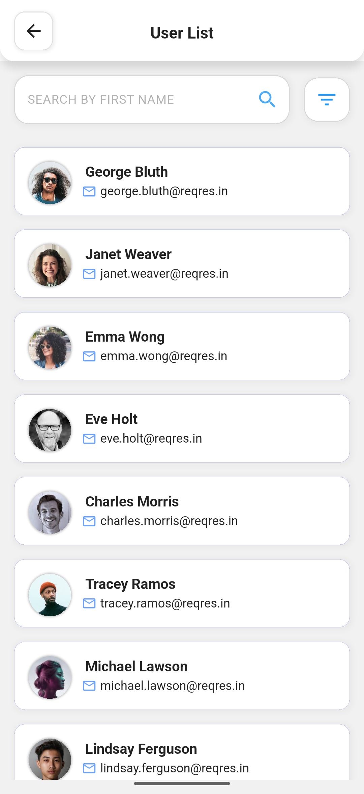

# 👨‍💻 Codebase – Flutter BLoC User List App

A Flutter application demonstrating clean architecture using **Cubit (BLoC)**, **Dio** for API calls, and **connectivity_plus** for network awareness. The app fetches users from a REST API and supports features like infinite scroll pagination, search, pull-to-refresh, error handling, and image caching.

---

## 🚀 How to Run the Project
Write the following command step by step and run the project.
<div> 
 # Clone the repo
 git clone https://github.com/yourusername/project-repo.git
</div>
<div>
 # Navigate to project directory
 cd project-repo
</div>
<div>
 # Get dependencies
 flutter pub get
</div>
<div>
 # Run on connected device or emulator
 flutter run
</div>

## 🛠️ Environment Setup

- Flutter version: 3.29.3
- Dart version: 3.7.2
- Android Studio / VS Code
- Tested on Android API level 35 Simulator

## 🚀 Features

- ✅ BLoC Cubit state management
- 🌐 API integration with Dio
- 📶 Internet connectivity detection
- 🔁 Infinite scrolling with pagination
- 🔍 Real-time user search by name
- 🔄 Pull to refresh
- 🖼 Cached profile images with loading placeholders
- ❌ No data and error handling UI
- 💡 Clean code architecture

## 🧱 Architecture Overview

The project follows a simple and scalable **Clean Code Architecture**:

<pre lang="markdown"> ``` 
lib/ 
├── core/ # Core utilities (Dio client, connectivity checker) 
├── data/ # API services and models 
├── logic/ # Business logic with BLoC Cubit 
├── presentation/ # UI screens and widgets 
└── main.dart # Entry point ``` </pre>

## 📱 Screenshots

<div align="center">
  
  &nbsp;&nbsp;&nbsp;&nbsp;&nbsp;&nbsp;&nbsp;&nbsp;&nbsp;&nbsp;&nbsp;&nbsp;
  
</div>

## 🧪 Key Features Explained

✅ Pull to Refresh
Implemented using RefreshIndicator to reload the first page of data and reset pagination.

✅ Infinite Scroll Pagination
Detects scroll position and triggers next page fetch automatically when the user scrolls near the bottom.

✅ Local Search
Filters the already fetched users by name using simple string matching.

✅ Connectivity Check
Checks internet connection before calling the API. Displays a toast if offline.

✅ Cached Images
Profile pictures are loaded and cached using cached_network_image for better performance and offline support.

✅ Empty and Error UI States
Handles:
- API failure with a friendly error message.
- Empty result after search or API response with “No users found”.


## 📦 Packages Used

| Package                | Purpose                                    |
|------------------------|--------------------------------------------|
| `flutter_bloc`         | State management using Cubit               |
| `dio`                  | Networking and API calls                   |
| `cached_network_image` | Image caching and loading                  |
| `connectivity_plus`    | Internet connectivity monitoring           |
| `fluttertoast`         | Display toast messages                     |

## 🔗 API Used

- [https://reqres.in/api/users](https://reqres.in/api/users)
Supports pagination with parameters:
- `?page=1&per_page=10`

📄 Manual JSON Parsing
User model is manually parsed using code generated from https://app.quicktype.io to avoid using code generation libraries.

## 🧹 Improvements Possible

- Add unit/widget tests.
- Add persistent local caching with Hive/SharedPreferences.
- Add dependency injection using get_it.
- Improve accessibility and localization.

## 🧑‍💻 Author

Anindya Duti Dhar
GitHub: @Anindya-Duti-Dhar

## 📝 License

This project is for example purposes only and not licensed for production use.
